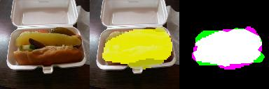

# FCN_MSCOCO_Food_Segmentation

Simple keras FCN Encoder/Decoder model for MS-COCO (food subset) segmentation

Input data: [http://mscoco.org/dataset/#overview]

Prepared input data (with 4 classes of food): [https://cloud.mail.ru/public/8SqL/jvJhJytn6]

DL-Framework: [https://keras.io/]

MS-COCO Python API: [https://github.com/pdollar/coco]

Some results: [https://cloud.mail.ru/public/CPCy/rdzs4Zt3W]

